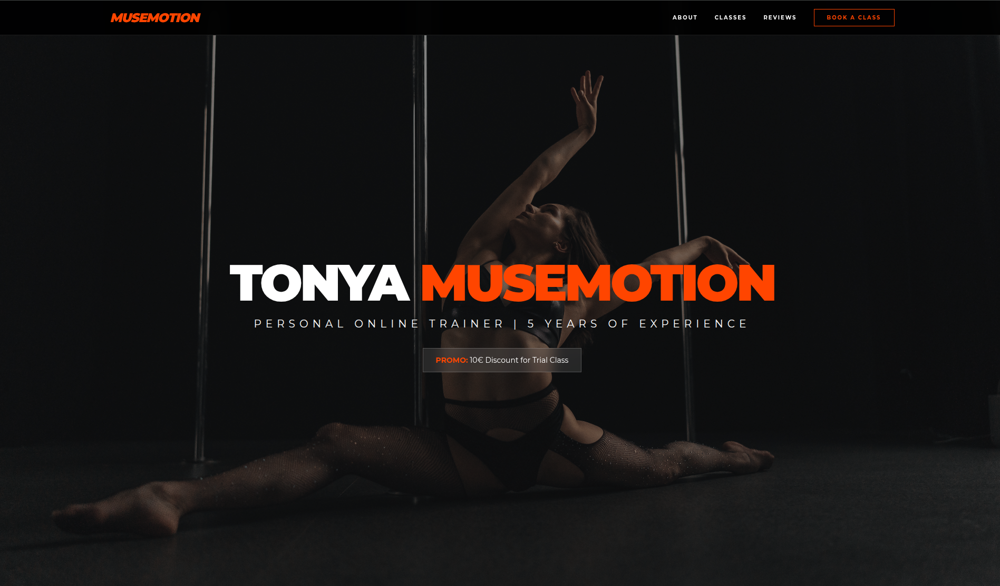
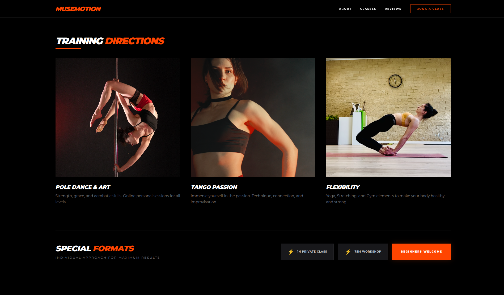
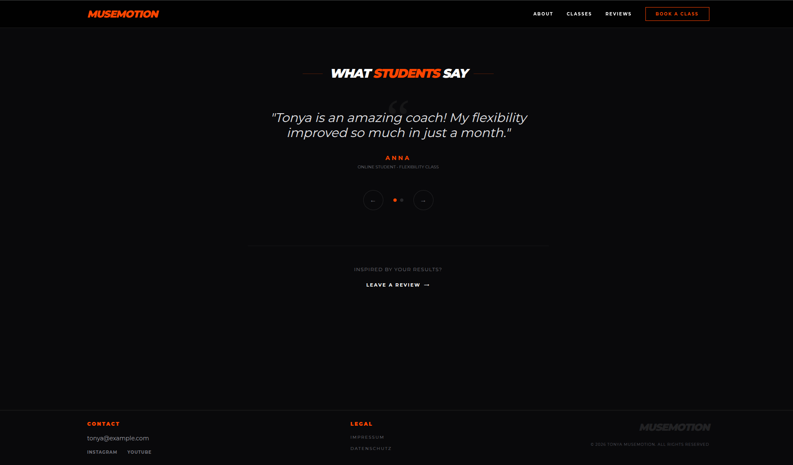

# Tonya Musemotion | Dance & Movement ⚡💃

A sleek, immersive, and responsive landing page for Tonya, a personal online trainer specializing in Pole Dance, Tango, and Body Balance.

[🌐 **Live Demo**](https://olhakhodakivska.github.io/tonya-musemotion/)

---

## 🚀 About The Project

"Tonya Musemotion" is a modern single-page website designed to capture the energy and elegance of physical movement. The core philosophy—where art meets physical training—is embodied through a dynamic user experience and high-end visual aesthetics.

This repository serves as a practical example of building a fast, component-free frontend using modern tooling (`Vite`), utility classes (`Tailwind CSS`), and vanilla JavaScript.

### Key Features:

- **Dark & Energetic Theme:** A sophisticated dark mode aesthetic using deep black backgrounds (`#000`) contrasted with a vibrant brand color (`#FF4500`).
- **Vertical Visual Experience:** High-impact showcase of vertical "action" shots with elegant hover effects and gradient overlays.
- **Responsive Typography:** Wide tracking, uppercase letters, and italic accents create a dynamic, sporty, and artistic mood.
- **Fully Responsive:** Seamless experience across all device sizes, from mobile phones to large desktops.
- **Interactive Components:** Custom-built modal windows for booking and reviews, and a touch-friendly carousel.

---

## 🛠 Tech Stack

- **Vite** - Next Generation Frontend Tooling for rapid development.
- **Tailwind CSS** - A utility-first CSS framework for efficient styling.
- **Vanilla JavaScript (ES6)** - Used for modal logic, date handling, and touch-swipe mechanics.
- **HTML5 & CSS3** - Semantic structure and custom animations.

---

## 📸 Screenshots

### Header & Hero Section

_A striking introduction featuring bold typography and a cinematic background blend._



### Training Directions & Special Formats

_A clean, high-impact grid showcasing discipline-specific photography in a professional 3-column layout._



### Student Reviews & Footer

_A custom, lightweight testimonial slider with interactive navigation, followed by a compliant footer._



---

## 💫 Detailed Project Development History

We undertook a comprehensive redesign to transform the initial concept into a polished, compliant, and visually superior product. The work involved:

### 1. Visual Overhaul (Vertical Shift)

- **Grid Transformation:** Converted the "Training Directions" from an 8-card grid into a streamlined, professional 3-column grid (`md:grid-cols-3`).
- **縦長 (Tatenaga) Layout:** Redesigned cards to prioritize high-quality **vertical photography** (aspect ratio `2/3`). This maximizes the display of movement and grace.
- **Hover Effects:** Implemented a complex hover state including image scaling (`group-hover:scale-110`) and a conditional gradient overlay to maintain text readability.

### 2. Layout & Spacing ("Air and Focus")

- **Special Formats:** Separated the "Special Formats" box from the main class grid. We transformed it into a dedicated, spacious horizontal layout (`mt-24 pt-12 flex-row`), giving it the breathing room it deserved and improving the visual flow.
- **Typography Scale:** Standardized heading sizes (`text-4xl md:text-6xl`) to create a clear hierarchy.

### 3. Mobile Experience Optimization

- **Responsive Adjustments:** Finely tuned all spacing (`gap-10`, `px-6`), typography, and container sizes for seamless readability on narrow screens.
- **Carousel Refinement:** Ensured the custom review slider remains lightweight and responsive, providing natural touch-swipe support on mobile.

### 4. Legal Compliance (GDPR/DSGVO)

- **Full Impressum & Datenschutz:** Wrote complete, юридично структуровані юридичні тексти specific for a business based in Berlin, Germany.
- **Dynamic Date Logic:** Integrated a small JavaScript function (`document.getElementById('year').textContent = new Date().getFullYear()`) into all footers and legal pages to ensure the year is always current.

---

## 💻 Getting Started

### Prerequisites

- **Node.js** (v18 or higher)
- **npm** (v9 or higher)

### Installation & Setup

1.  **Clone the repository:**

    ```bash
    git clone [https://github.com/olhakhodakivska/tonya-musemotion.git](https://github.com/olhakhodakivska/tonya-musemotion.git)
    ```

2.  **Navigate into the project directory:**

    ```bash
    cd tonya-dance-site
    ```

3.  **Install dependencies:**

    ```bash
    npm install
    ```

4.  **Start the development server:**

    ```bash
    npm run dev
    ```

5.  **Build for production:**
    ```bash
    npm run build
    ```

---

## 📄 License

Distributed under the MIT License. See `LICENSE` for more information.

---

**Created by Olhakhodakivska**
